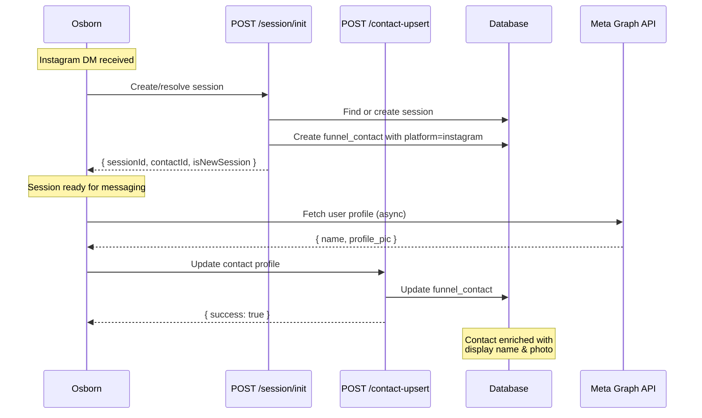

# Instagram Contact Upsert API

## Overview

The Instagram Contact Upsert endpoint allows Osborn to asynchronously update Instagram user profile information (display name, profile photo) after the initial session creation. This enables fast first message response by deferring profile info fetching.

## Endpoint

```
POST /api/workspace/:workspaceId/session/:sessionId/contact-upsert
```

## Purpose

- Update existing contact with Instagram profile data fetched from Meta Graph API
- Enrich contact records with display name and profile photo
- Idempotent operation - safe to call multiple times
- Async profile enrichment that doesn't block message flow

## Authentication

No authentication required (internal API for Osborn integration).

## Request Parameters

### URL Parameters

| Parameter | Type | Required | Description |
|-----------|------|----------|-------------|
| `workspaceId` | string | Yes | Workspace UUID, `configId`, or `space-{configId}` format |
| `sessionId` | string | Yes | Session ID (wses_xxx format) returned from session init |

### Request Body

```json
{
  "platform": "instagram",
  "ig_user_id": "1784....",
  "ig_username": "username_here",
  "contact": {
    "displayName": "Jane Doe",
    "profilePhotoUrl": "https://..."
  },
  "refreshedAt": "2025-12-15T20:05:12Z"
}
```

#### Body Parameters

| Field | Type | Required | Description |
|-------|------|----------|-------------|
| `platform` | string | Yes | Must be "instagram" |
| `ig_user_id` | string | Yes | Instagram user ID (stable identifier) |
| `ig_username` | string | Yes | Instagram username (can change) |
| `contact` | object | Yes | Contact profile data |
| `contact.displayName` | string | No | User's display name from Instagram |
| `contact.profilePhotoUrl` | string (URL) | No | URL to user's profile photo |
| `refreshedAt` | string (ISO 8601) | No | Timestamp when profile was fetched |

## Response

### Success Response (200 OK)

```json
{
  "success": true
}
```

### Error Responses

#### 400 Bad Request - Invalid Request Body

```json
{
  "success": false,
  "error": "Invalid request body",
  "details": [
    {
      "code": "invalid_type",
      "expected": "string",
      "received": "undefined",
      "path": [
        "ig_user_id"
      ],
      "message": "ig_user_id is required"
    }
  ]
}
```

#### 404 Not Found - Workspace Not Found

```json
{
  "success": false,
  "error": "Workspace not found"
}
```

#### 404 Not Found - Session Not Found

```json
{
  "success": false,
  "error": "Session not found"
}
```

#### 404 Not Found - Contact Not Found

```json
{
  "success": false,
  "error": "Contact not found for session"
}
```

#### 500 Internal Server Error

```json
{
  "success": false,
  "error": "Failed to update contact"
}
```

## Integration Flow



## Usage Examples

### Example 1: Update Contact with Display Name

```bash
curl -X POST \
  'https://api.example.com/api/workspace/6e030953-c762-4b4a-bd72-561146ee8c70/session/wses_abc123/contact-upsert' \
  -H 'Content-Type: application/json' \
  -d '{
    "platform": "instagram",
    "ig_user_id": "1784567890",
    "ig_username": "johndoe",
    "contact": {
      "displayName": "John Doe"
    },
    "refreshedAt": "2025-12-15T20:05:12Z"
  }'
```

**Response:**
```json
{
  "success": true
}
```

### Example 2: Update Contact with Profile Photo

```bash
curl -X POST \
  'https://api.example.com/api/workspace/518710/session/wses_xyz789/contact-upsert' \
  -H 'Content-Type: application/json' \
  -d '{
    "platform": "instagram",
    "ig_user_id": "1784567890",
    "ig_username": "johndoe",
    "contact": {
      "profilePhotoUrl": "https://scontent.cdninstagram.com/v/t51.2885-19/..."
    }
  }'
```

**Response:**
```json
{
  "success": true
}
```

### Example 3: Update Contact with Both Fields

```bash
curl -X POST \
  'https://api.example.com/api/workspace/space-518710/session/wses_def456/contact-upsert' \
  -H 'Content-Type: application/json' \
  -d '{
    "platform": "instagram",
    "ig_user_id": "1784567890",
    "ig_username": "johndoe",
    "contact": {
      "displayName": "John Doe",
      "profilePhotoUrl": "https://scontent.cdninstagram.com/v/t51.2885-19/..."
    },
    "refreshedAt": "2025-12-15T20:05:12Z"
  }'
```

**Response:**
```json
{
  "success": true
}
```

## Database Updates

The endpoint updates the following fields in the `funnel_contacts` table:

| Field | Description |
|-------|-------------|
| `ig_user_id` | Instagram user ID (stable identifier) |
| `ig_username` | Instagram username (display name) |
| `first_name` | Set to `displayName` if provided |
| `profile_photo_url` | Profile photo URL if provided |
| `updated_at` | Set to `refreshedAt` or current timestamp |
| `metadata` | Extended with Instagram profile info |

### Metadata Structure

```json
{
  "ig_user_id": "1784567890",
  "ig_username": "johndoe",
  "profile_photo_url": "https://...",
  "last_profile_refresh": "2025-12-15T20:05:12Z"
}
```

## Idempotency

This endpoint is idempotent - calling it multiple times with the same data will:
- Update the contact each time
- Not create duplicates
- Always return success if the session and contact exist

## Best Practices

1. **Call After Session Init**: Always call this endpoint after successfully creating/resolving a session via `/session/init`

2. **Async Profile Fetching**: Fetch profile data from Meta Graph API asynchronously to avoid blocking message flow

3. **Error Handling**: Handle 404 errors gracefully - they indicate the session or contact doesn't exist

4. **Timestamp Tracking**: Use `refreshedAt` to track when profile data was last fetched from Instagram

5. **Partial Updates**: You can update just the display name, just the photo, or both - all fields are optional

6. **Username Changes**: Instagram usernames can change - always send the latest `ig_username` to keep records up to date

## Related Endpoints

- [`POST /api/workspace/:workspaceId/session/init`](./instagram-session-init.md) - Initialize or resolve Instagram session
- `POST /api/workspace/:workspaceId/session/:sessionId/message/user` - Send user message to session

## Technical Notes

### Field Mapping

| Instagram API Field | Database Field | Notes |
|---------------------|----------------|-------|
| `id` | `ig_user_id` | Stable user identifier |
| `username` | `ig_username` | Can change over time |
| `name` | `first_name` | Display name |
| `profile_pic` | `profile_photo_url` | Profile photo URL |

### Performance Considerations

- Single database query to update contact
- Indexed lookups on `workspace_session_id`
- Minimal data transfer
- No external API calls

### Security Considerations

- Session validation ensures session belongs to workspace
- Contact ownership verified via `workspace_session_id` link
- Strict Zod validation on all inputs
- URL validation for profile photo URLs

## Troubleshooting

### "Session not found" Error

**Cause**: The session ID doesn't exist or doesn't belong to the workspace.

**Solution**: Verify the session ID returned from `/session/init` is correct.

### "Contact not found for session" Error

**Cause**: No contact is linked to this session.

**Solution**: This shouldn't happen if the session was created via `/session/init`. Check database integrity.

### "Invalid request body" Error

**Cause**: Missing required fields or invalid data types.

**Solution**: Ensure all required fields are present and match the schema:
- `platform` must be "instagram"
- `ig_user_id` and `ig_username` are required strings
- `profilePhotoUrl` must be a valid URL if provided

## Support

For issues or questions about this endpoint, contact the development team or refer to:
- [Instagram Session Init Architecture](../../INSTAGRAM_SESSION_INIT_ARCHITECTURE.md)
- [Instagram Contact Upsert Architecture](../../INSTAGRAM_CONTACT_UPSERT_ARCHITECTURE.md)